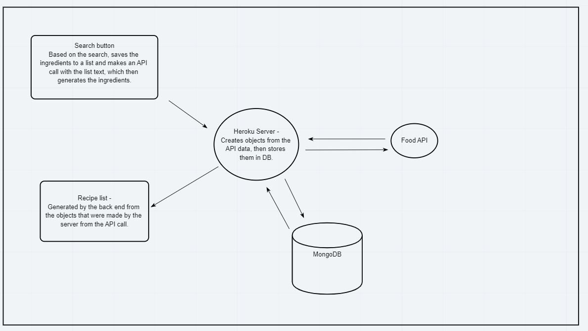
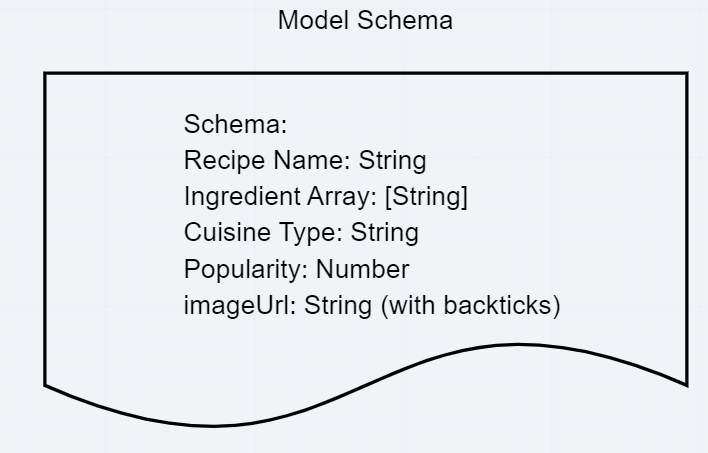

# Project Prep # 1

# Group Members:
- Jona Brown
- Shan Jiang
- Q Hashi
- Alex Vogt
## What are the key strengths of each person on the team?

### Alex
CSS/Bootstrap: 9/10
Front end JS - 6/10
Back end JS - 8/10

### Q
css/Bootstrap - 6/10
Front end JS - 8/10
Back end JS - 5/10

### Shan 
css/Bootstrap - 6/10
Front end JS - 5/10
Back end JS - 6/10

### Jona
css/Bootstrap - 7/10
Front end JS - 8/10
Back end JS - 9/10

### How can you best utilize these strengths? In which professional competencies do you each want to develop greater strength?

- Dividing projects based off of our strengths in each area.
- For professional competencies, we can divide up our strengths to suit each member of the team.
If someone is struggling with a specific topic, or want to learn more about one - pair them with a member in
the group who is confident in the topic.

### Knowing that every person in your team needs to understand all aspects of the project, how do you plan to approach the day-to-day work?0
- team meetups, meeting back up throughout the day.
  - 9AM: Morning Meetup
  - 1PM: Optional check-in
  - 5PM: evening check-in PUSH PARTY!!!

# Conflict Plan

### What will be your group’s process to resolve conflict, when it arises? 
- discuss with team member about particular disagreement. 
``` js 
if (disagreement !== resolved) {
    discuss in group and vote on matter at hand;
    discuss overall outcome with group as well;
}
```

### What will your team do if one person is taking over the project and not letting the other members contribute?

- Refer to problem #1 of conflict plan. Group intervention!

### How will you approach each other and the challenges of the project knowing that it is impossible for all members to be at the exact same place in understanding and skill level?

- Treat each challenge with respect to the other member. We will also be working in groups of 2,
with each member having differing strengths and weaknesses to balance out the workload.

### How will you raise concerns to members who are not adequately contributing?
- Refer to problem #1 again, and ask questions to see if we can help rather than be accusatory.

### How and when will you escalate the conflict if your resolution attempts are unsuccessful?

- Go to instructor about the issue and explain. Have all group members present.

# Communication plan

### What hours will you be available to communicate? How will you communicate after hours and on the weekend?

- between 9AM - 6PM

- For after hours/weekends, reach out on slack

### What platforms will you use to communicate (ie. Slack, phone …)?

- Slack will be main source of communication.

### How often will you take breaks?

- When you need to.

- Communicate with your navigator/driver about break times.

### What is your plan if you start to fall behind?

- Accept that it will not work at times. 

- Step back and look at what is left to do and go back to basics.

- Bring up issues earlier in the problem rather than waiting until end of day.

- Don't be afraid to take a break on the specific problem.

### What is your strategy for ensuring everyone’s voice is heard?

- Meetings in morning and evening to address all concerns from everyone.

### How will you ensure that you are creating a safe environment where everyone feels comfortable speaking up?

- Encourage team members to share their ideas
- Have a helpful mindset, attempt to not be negative with your outlook, and work as a team.

### How you will identify tasks, assign tasks, know when they are complete, and manage work in general?

- Keeping accountability through Trello will be the primary manner of communication with work. 

### What project management tool will be used?

- Trello
- Slack

## Git Process

### What components of your project will live on GitHub

- Everything but project management tool, all of it!!

### What is your Git flow?

- Everybody will clone staging repo.
- Everyone will checkout a new branch of the staging repo.
- At EOD, all will push to github, attempt to merge, resolve conflicts if any, make sure to PULL at EOD.

### How often will you merge?

- every day at the evening meet-up.

### How will you communicate that it’s time to merge?

- Have a set time.

### Who merges PRs?

Anyone, as we will all be in group together.

### User Stories

- MVP- As a user, I would like a list of recipes generated when I input the ingredients that I have in one search area.

- MVP- As a user, I would like to view the ingredients that I have input so far.

- STRECH GOAL - As a user, I would like to be able to sort recipes by category (cuisine type, culture e.t.c.)

- STRETCH GOAL - As a user, I would like to be able to be able to sign in and view old recipes that I used.

- STRETCH GOAL - As a user, I would like to be redirected to the website that contains my recipe.

- STRETCH GOAL - As a user, I would like to input multiple ingredients and get back a percentage or similar match to how close each recipe is to my ingredients.

#### Wireframe


#### Domain Modeling



#### Schema Diagram

